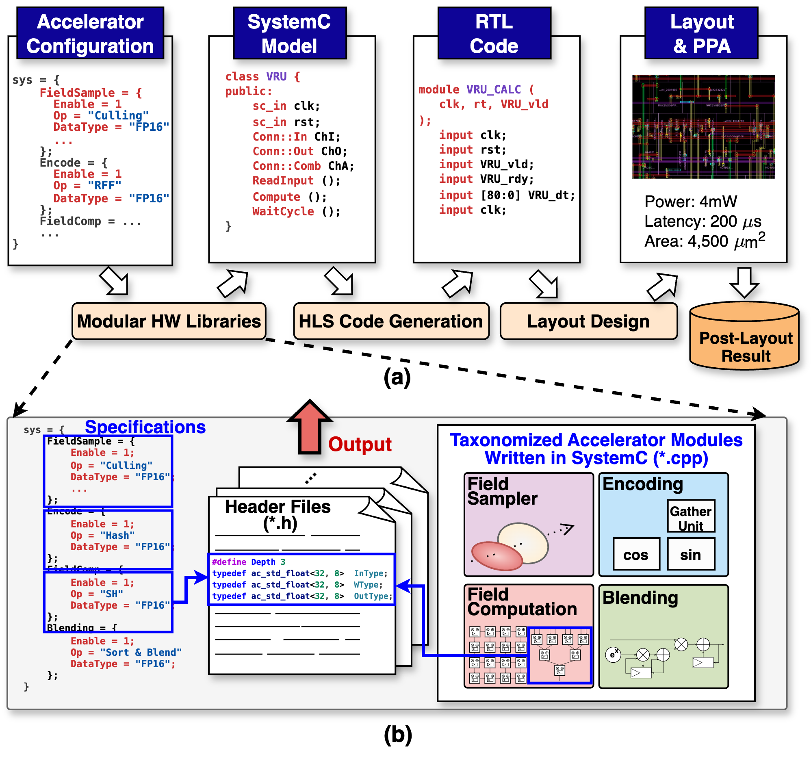

# RenderSim Hardware Platform



This folder is for generating results of hardware module latency, throughput, area, and power.

## Directory Structure

- [S0_scripts/](S0_scripts/): Entry scripts for HLS, FC, and PWR flows; see [linker.json](S0_scripts/linker.json) for accelerator/module lists; outputs include `PPA.log`, `timing.log`, `failed.log`. See also [builder.py](S0_scripts/builder.py).
- [A1_cmod/](A1_cmod/): All hardware modules, organized by design stage (e.g., Encode, FieldComp, Blending).
- [S1_projconf/](S1_projconf/): Configuration files (makefile includes, HLS include lists) per module/version.
- [examples/](examples/): Hardware configs and benchmarking examples. Fill required values in [examples/hardware_configs/](examples/hardware_configs/).

## Table of Content

- [Environment Setup](#environment-setup)
- [Obtain all module results](#obtain-all-module-results)
- [Example of obtaining power and area of single module](#example-of-obtaining-power-and-area-of-single-module)
  - [Obtain Throughput, Latency, Power and Area](#obtain-throughput-latency-power-and-area)
  - [View Results and Logs](#view-results-and-logs)
- [Tutorial: Step by step developing customized modules](#tutorial-step-by-step-developing-customized-modules)
  - [Step 1: Overview](#step-1-overview)
  - [Step 2: Folder Structure](#step-2-folder-structure)
  - [Step 3: Coding in SystemC](#step-3-coding-in-systemc)
  - [Step 4: Testing](#step-4-testing)
  - [Step 5: Obtain power and area of the implemented module](#step-5-obtain-power-and-area-of-the-implemented-module)
  - [Step 6: Configure linker.json](#step-6-configure-linkerjson)
- [Others](#others)
  - [Hardware Library Specification](#hardware-library-specification)
  - [How It Works (builder.py Overview)](#how-it-works-builderpy-overview)

## Environment Setup

```bash
# Assume zsh
setenv CATAPULT_HOME "/path/to/catapult/2024.1_2"
setenv MATCHLIB_HOME "/path/to/matchlib-20240726/cmod/include"
setenv PDK_PATH "/path/to/..."  # Used in S0_scripts/hls/catapult.global.tcl
setenv BASELIB ".."             # Used in S0_scripts/hls/catapult.global.tcl
setenv TECHNOLOGY ".."          # Used in S0_scripts/hls/catapult.global.tcl
```


## Obtain all module results

Run the entire pipeline (HLS → FC → PWR) for all accelerators defined in `linker.json`:
```bash
cd S0_scripts
python3 run_hls.py --all
python3 run_fc.py --all
python3 run_pwr.py --all
```

Run the entire pipeline for a single accelerator (e.g., CICERO):
```bash
cd S0_scripts
python3 run_hls.py CICERO
python3 run_fc.py CICERO
python3 run_pwr.py CICERO
```

After running the scripts, you can find results in the following log files:

**Summary logs:**
- `S0_scripts/PPA.log`: Contains area, power, latency, and other summary metrics for all processed modules
- `S0_scripts/timing.log`: Time taken for each build step
- `S0_scripts/failed.log`: Any failed commands or errors

**Per-module logs:**
- `S0_scripts/<module>_<flow>.log` (e.g., `Blending_QSU_hls.log`): Detailed terminal output for specific module and flow

## Example of obtaining power and area of single module

### Obtain Throughput, Latency, Power and Area

```bash
cd S0_scripts                   # enter the scripts directory

# run high-level synthesis
python3 run_hls.py --module Blending/QSU  # rough results in PPA.log and timing.log, and terminal output in hls.log
./report_module.sh Blending/QSU           # extract and summarize all results
```

- Sample output

```yaml
=======================================================================================================
  TOTAL AREA (After Assignment):    1117.325             592.000 426.000                              
=======================================================================================================
  pre_pwropt_default_Verilog       100.00    100.00 
  
Power Report (uW)
                                                                                                                               Memory Register Combinational Clock Network  Total 
  ---------------------------------------------------------------------------------------------------------------------------- ------ -------- ------------- ------------- ------
--
  pre_pwropt_default_Verilog                                                                                                                                                      
    Static                                                                                                                       0.00     6.84          5.51          0.35  12.69 
    Dynamic                                                                                                                      0.00   370.47         59.54        184.36 614.36 
    Total                                                                                                                        0.00   377.31         65.05        184.71 627.05 
                                                                                                                                                                                  
=======================================================================================================
Processes/Blocks in Design
  Process       Real Operation(s) count Latency Throughput Reset Length II Comments 
  ------------- ----------------------- ------- ---------- ------------ -- --------
  /QSU/QSU_CALC                      63       2          1            1  0          
  Design Total:                      63       2          1            1  1          
  
Clock Information
  Clock Signal Edge   Period Sharing Alloc (%) Uncertainty Used by Processes/Blocks 
  ------------ ------ ------ ----------------- ----------- ------------------------
  clk          rising  1.000              0.00    0.000000 /QSU/QSU_CALC            
  
I/O Data Ranges
  Port          Mode DeclType DeclWidth DeclRange ActType ActWidth ActRange 
  ------------- ---- -------- --------- --------- ------- -------- --------
  clk           IN   Unsigned         1                                     
=======================================================================================================
#            V C S   S i m u l a t i o n   R e p o r t 
# Time: 38000 ps
# CPU Time:      0.050 seconds;       Data structure size:   0.0Mb
```

## Tutorial: Step by step developing customized modules

### Step 1: Overview

Navigate to `A1_cmod` and create your own modules. You can organize them into a folder with multiple submodules or subdirectories. Regardless of the folder structure, all modules can be processed following the instructions in [Example of obtaining power and area of a single module](#example-of-obtaining-power-and-area-of-single-module).

- *E.g.*, `mkdir -p A1_cmod/Blending/QSU` — this creates a directory for building a Quicksort unit.

### Step 2: Folder Structure

Organize hardware modules under `A1_cmod` by taxonomy (e.g., `Encode`, `FieldComp`, `Blending`, `Sample`). If a module has different versions, create versioned include folders such as `include_v2`, `include_v3` to store version-specific headers or package files. If two modules share the same base name but differ in implementation, suffix the directory name with `_vX` (e.g., `module_v2`, `module_v3`). All versions and naming must be reflected in `S0_scripts/linker.json` and kept consistent with configs under `S1_projconf`.

Example directory tree:
```bash
A1_cmod/
├─ Blending/
│   ├─ QSU/
│   ├─ include_v1/
│   ├─ include_v2/
├─ Encode/
│   ├─ AG/
│   ├─ include_v2/
│   ├─ include_v3/
├─ FieldComp/
│   ├─ NPU_v1/
│   ├─ NPU_PE_v1/
```

**Key rules:**
- `S1_projconf/<taxonomy>/<module>/hlsinclude.mk` must match the include version present in `A1_cmod`
- Versioned include paths and config files must match the actual module structure in both `A1_cmod` and `S0_scripts/linker.json`

**S1_projconf: Configuration Files**

All configuration files for each module should be placed under the `S1_projconf` directory. This directory holds each module's config files, such as Makefile includes, header lists, and HLS include settings.

Example Makefile include path:
```makefile
${MATCHLIB_HOME} ${PWD}/../A1_cmod/Blending/include_v1
```

### Step 3: Coding in SystemC

Implement your own modules using SystemC. You can reference sample implementations in the same folder or check out the [MatchLib examples](https://github.com/hlslibs/matchlib_toolkit/tree/main/examples) and the [Connections guide](https://github.com/hlslibs/matchlib_connections/blob/master/pdfdocs/connections-guide.pdf) for guidance on developing hardware in SystemC.

### Step 4: Testing

Once the module is implemented, you can compile and test it locally without involving HLS tools, using standard C simulation.

```bash
cd A1_cmod/Blending/     # navigate to the desired taxonomy directory
cmake .                  # configure the build system for all modules in this taxonomy
cd QSU/                  # navigate to the specific module
make                     # compile the module
./sim_QSU                # run C simulation
```

Note: Each taxonomy directory (`Blending/`, `Encode/`, `FieldComp/`, `Sample/`) now has its own `CMakeLists.txt` file that includes all modules within that taxonomy. This allows you to build and test modules within each category independently.

- Sample output

```yaml
Connections Clock: tb.clk Period: 1 ns
QSUInput @ timestep: 19 ns: Depth = 10, GID = 1000
QSUInput @ timestep: 20 ns: Depth = 20, GID = 1001
QSUInput @ timestep: 21 ns: Depth = 30, GID = 1002
QSUInput @ timestep: 22 ns: Depth = 40, GID = 1003
QSUInput @ timestep: 23 ns: Depth = 50, GID = 1004
QSUInput @ timestep: 24 ns: Depth = 60, GID = 1005
Expected pivot values: 20 40 60 80 100 120 140 
QSUOutput @ timestep: 29 ns: GID = 1000, Subset = 0
  Expected Subset: 0 ✓
QSUOutput @ timestep: 30 ns: GID = 1001, Subset = 1
  Expected Subset: 1 ✓
QSUOutput @ timestep: 31 ns: GID = 1002, Subset = 1
  Expected Subset: 1 ✓
...
```

### Step 5: Obtain power and area of the implemented module

Refer to [Example of obtaining power and area of a single module](#example-of-obtaining-power-and-area-of-single-module).

### Step 6: Configure linker.json

After you have successfully implemented, tested, and verified your module works correctly, the final step is to register it in the system by configuring `linker.json`.

- **Location**: `S0_scripts/linker.json`
- **Taxonomy**: `Sample`, `Encode`, `FieldComp`, `Blending`
- **Modules must match directories** under `A1_cmod/<Taxonomy>/<Module[_vX]>`
- **For versioned implementations**, suffix module names with `_vX` and keep `S1_projconf/<Taxonomy>/<Module>/hlsinclude.mk` consistent

`linker.json` defines all accelerators and their modules for each design stage. Each key represents an accelerator (e.g., `"SYSTEM1"`, `"SYSTEM2"`), with each stage (such as `Sample`, `Encode`, `FieldComp`, `Blending`) containing a list of modules.

Example (adding VRU module under Blending):
```json
{
  "SYSTEM1": {
    "Sample": [],
    "Encode": ["AG", "reducer"],
    "FieldComp": ["NPU_v1", "NPU_PE_v1"],
    "Blending": ["VRU"]
  }
}
```

If a module is listed under `Encode`, the script will process `Encode/<module_name>` for that accelerator. Once configured, you can run the full pipeline for your accelerator using the commands in [Obtain all module results](#obtain-all-module-results).

## Others

### How It Works (builder.py Overview)

The `S0_scripts/builder.py` script is the main flow controller that automates the build and reporting flow for hardware modules:

1. **Parses arguments** to select which accelerator(s) or module(s) to process
2. **Reads `linker.json`** to list all modules for each target
3. **For each module:**
   - Cleans old build directories for the selected flow (HLS → `A2_hls/.../build_hls`, FC → `A4_fusion/.../build_fc`, PWR → `A5_pwr/.../build_pwr`)
   - Runs the build (via make)
   - Runs the report script
   - Logs area/power/timing results
4. **All results are aggregated** and output as log files

The script supports three flows:
- **HLS (High-Level Synthesis)**: `run_hls.py`
- **FC (Fusion Compiler)**: `run_fc.py` 
- **PWR (Power Analysis)**: `run_pwr.py`

Each flow can be run for all accelerators (`--all`), a specific accelerator (e.g., `CICERO`), or a specific module (`--module Encode/AG`).


### Hardware Library Specification

For a detailed list of supported hardware modules, their I/O datatypes, architectural parameters, and legal optimizations, see [`specification.md`](specification.md).

