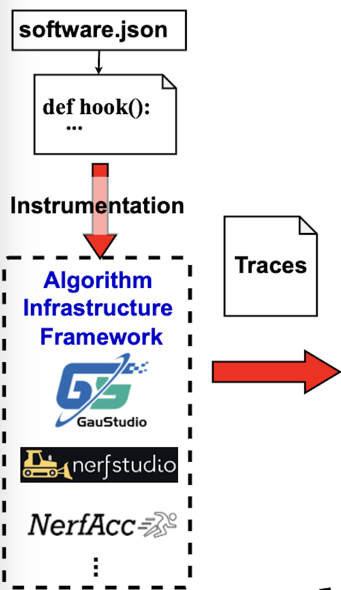

# RenderSim Neural Rendering Instrumentation



This folder provides tools to collect execution traces from neural rendering models (e.g., Nerfstudio) and to transform/visualize those traces for RenderSim analysis.

## Folder structure
- `nerfstudio_vendor/`: files used to do instrumentation in nerfstudio
  - `instrumentation/tracing.py` and `trace_config.json`
  - `scripts/eval.py` (evaluation with tracing)
  - `scripts/train.py` (training with tracing support)
- `operator_mapping.py`: maps traced functions to normalized operator taxonomy
- `dag_to_operators_integration.py`: converts traced DAGs to realistic operators
- `plot_transformed_operators.py`: visualizes transformed operator graphs
- `plot_dot_subgraph.py`: extract and render a specific subgraph cluster from a grouped DOT file

For a quick end-to-end example (training -> trace -> analyze), see the root `README.md`. This page contains a more detailed setup, training, and evaluation guide.

## Table of Contents

- [Quick Setup](#quick-setup)
- [Manual Setup](#manual-setup)
  - [Setup CUDA](#setup-cuda)
  - [Setup Nerfstudio](#setup-nerfstudio)
    - [Install dependencies](#install-dependencies)
    - [Install Nerfstudio](#install-nerfstudio)
    - [Copy instrumentation files](#copy-instrumentation-files)
    - [Download dataset](#download-dataset)
    - [Reconstruct a scene](#reconstruct-a-scene)
  - [Render a scene / Collect Traces](#render-a-scene--collect-traces)
- [Transform and Visualize Operators](#transform-and-visualize-operators)
- [Custom Pipeline Instrumentation](#custom-pipeline-instrumentation)
- [Testing and Validation](#testing-and-validation)

## Quick Setup

See the root `README.md` for Quick setup (Nerfstudio + tracing). This page provides the full detailed setup, training, and evaluation guide.

## Manual Setup

### Setup CUDA

- Install CUDA-11.8

```bash
wget https://developer.download.nvidia.com/compute/cuda/11.8.0/local_installers/cuda_11.8.0_520.61.05_linux.run
chmod +x ./cuda_11.8.0_520.61.05_linux.run
./cuda_11.8.0_520.61.05_linux.run --silent --tmpdir=. --toolkit --toolkitpath=/change/this/path/cuda-11.8/
export PATH=/change/this/path/cuda-11.8/bin${PATH:+:${PATH}}
```

### Setup Nerfstudio

#### Install dependencies

```bash
# Use local environment (recommended) or global environment
conda create --prefix $PWD/rendersim python=3.8 -y
conda activate $PWD/rendersim

pip install --upgrade pip setuptools
pip install torch==2.1.2+cu118 torchvision==0.16.2+cu118 --extra-index-url https://download.pytorch.org/whl/cu118
conda install -c nvidia/label/cuda-11.8.0 cuda-toolkit -y
pip install ninja git+https://github.com/NVlabs/tiny-cuda-nn/#subdirectory=bindings/torch
conda install -c conda-forge graphviz python-graphviz -y
```

#### Install Nerfstudio

```bash
# If using included submodule
cd nerfstudio && pip install -e . && cd ..

# Alternatively, external checkout
# git clone https://github.com/nerfstudio-project/nerfstudio.git
# cd nerfstudio && pip install -e . && cd ..  # Return to RenderSim directory
```

#### Copy instrumentation files

```bash
# Optionally copy the vendor reference files into your nerfstudio checkout
cp -f Instrumentation/nerfstudio_vendor/instrumentation/tracing.py nerfstudio/nerfstudio/instrumentation/ || true
cp -f Instrumentation/nerfstudio_vendor/instrumentation/trace_config.json nerfstudio/nerfstudio/instrumentation/ || true
cp -f Instrumentation/nerfstudio_vendor/scripts/eval.py nerfstudio/nerfstudio/scripts/ || true
cp -f Instrumentation/nerfstudio_vendor/scripts/train.py nerfstudio/nerfstudio/scripts/train_instrumented.py || true
cp -f Instrumentation/nerfstudio_vendor/utils/eval_utils.py nerfstudio/nerfstudio/utils/ || true
cp -f Instrumentation/nerfstudio_vendor/utils/train_utils.py nerfstudio/nerfstudio/utils/ || true
```

#### Download dataset

```bash
mkdir -p /tmp/nerf
pip install gdown
cd /tmp/nerf
gdown '[nerf_synthetic.zip]'
unzip nerf_synthetic.zip -d nerf_synthetic
gdown '[360_v2.zip]'
gdown '[360_extra_scenes.zip]'
unzip 360_v2.zip -d mip360
unzip 360_extra_scenes.zip -d mip360
cd -  # Return to RenderSim directory
```

#### Reconstruct a scene

```bash
# Train three pipelines on the same scene (adjust data path as needed)
CUDA_VISIBLE_DEVICES=0 ns-train vanilla-nerf --output-dir output_result --max-num-iterations=10000 --data /tmp/nerf/nerf_synthetic/mic blender-data
CUDA_VISIBLE_DEVICES=1 ns-train instant-ngp  --output-dir output_result --max-num-iterations=10000 --data /tmp/nerf/nerf_synthetic/mic blender-data
CUDA_VISIBLE_DEVICES=2 ns-train splatfacto  --output-dir output_result --max-num-iterations=100000 --data /tmp/nerf/nerf_synthetic/mic blender-data
```

### Training with Tracing

```bash
# Train with tracing enabled at specific iterations
python nerfstudio/nerfstudio/scripts/train_instrumented.py vanilla-nerf \
  --output-dir output_result \
  --max-num-iterations=1000 \
  --data /tmp/nerf/nerf_synthetic/mic blender-data \
  --enable-trace \
  --trace-iterations 100 500 1000 \
  --trace-config-path nerfstudio/nerfstudio/instrumentation/trace_config.json

# This will save traces at iterations 100, 500, and 1000 to:
# output_result/vanilla-nerf-*/traces/execution_dag_iter_*.pkl
```

### Render a scene / Collect Traces

```bash
# Locate trained configs for each pipeline
CONFIG_VANILLA=$(find output_result -path "*vanilla-nerf*/*/config.yml" | head -n1)
CONFIG_INGP=$(find output_result -path "*instant-ngp*/*/config.yml" | head -n1)
CONFIG_SPLAT=$(find output_result -path "*splatfacto*/*/config.yml" | head -n1)

# Evaluate one image with tracing enabled (writes execution_dag.pkl)
# vanilla-nerf
OUT=traces/vanilla_$(date +%Y%m%d_%H%M%S)
mkdir -p "$OUT"
DISABLE_TRACE_PLOT=1 \
ns-eval \
  --load-config "$CONFIG_VANILLA" \
  --render-output-path "$OUT" \
  --enable-trace \
  --trace-config-path nerfstudio/nerfstudio/instrumentation/trace_config.json \
  --eval-image-indices 0

# instant-ngp
OUT=traces/instantngp_$(date +%Y%m%d_%H%M%S)
mkdir -p "$OUT"
DISABLE_TRACE_PLOT=1 \
ns-eval \
  --load-config "$CONFIG_INGP" \
  --render-output-path "$OUT" \
  --enable-trace \
  --trace-config-path nerfstudio/nerfstudio/instrumentation/trace_config.json \
  --eval-image-indices 0

# splatfacto (3D Gaussian Splatting)
OUT=traces/splatfacto_$(date +%Y%m%d_%H%M%S)
mkdir -p "$OUT"
DISABLE_TRACE_PLOT=1 \
ns-eval \
  --load-config "$CONFIG_SPLAT" \
  --render-output-path "$OUT" \
  --enable-trace \
  --trace-config-path nerfstudio/nerfstudio/instrumentation/trace_config.json \
  --eval-image-indices 0

# Traces: $OUT/execution_dag.pkl in each output directory
```

#### Key flags and env vars
- `--load-config PATH`: config.yml produced by `ns-train`
- `--render-output-path PATH`: where images and trace files are saved
- `--enable-trace`: turn on instrumentation to record the execution DAG
- `--trace-config-path PATH`: JSON with functions to trace (defaults to Nerfstudio’s instrumentation directory)
- `--eval-image-indices ...`: restrict which eval images to run; pass indices as separate integers (e.g., `0 1 2`).
- `DISABLE_TRACE_PLOT=1` (env): disables plotting pngs during trace to speed up runs and avoid GUI deps; the trace `execution_dag.pkl` is still written.

## Transform and Visualize Operators

```bash
# Transform DAG to realistic operators and generate visualizations
python Instrumentation/plot_transformed_operators.py "$OUT/execution_dag.pkl"
```

Outputs include coarse/fine graphs and a text summary of operator characteristics.

### Optional: plot a DOT subgraph cluster
If you have a grouped DOT (e.g., execution_dag_grouped.dot), you can extract and render a specific cluster:

```bash
python Instrumentation/plot_transformed_operators.py "$OUT/execution_dag.pkl" \
  --plot-dot-subgraph \
  --dot execution_dag_grouped.dot \
  --cluster-index coarse:0 \
  --out-prefix execution_dag_component0
```

(Or call the helper directly: `python Instrumentation/plot_dot_subgraph.py --dot ... --cluster-index ... --out-prefix ...`)

## Custom Pipeline Instrumentation

- In `Instrumentation/nerfstudio_vendor/instrumentation/trace_config.json`, specify functions to trace.
- Operator taxonomy categories (for mapping and visualization):
  - `SAMPLING`: Ray sampling and point generation
  - `ENCODING`: Positional, hash, or frequency encoding
  - `FIELD_COMPUTATION`: MLP, network inference
  - `BLENDING`: Volume rendering, alpha compositing

Test instrumentation quickly:

```bash
ns-eval --load-config your_config.yml --enable-trace --eval-image-indices 0
```

Verify the output contains your operators in `execution_dag.pkl`.

## Testing and Validation

```bash
# Minimal smoke test for RenderSim core
python -c "import rendersim_cpp as rs; print('ok')"
```

For quick start and an end-to-end example command, see the root `README.md` (ns-eval example and analyze a trace).
