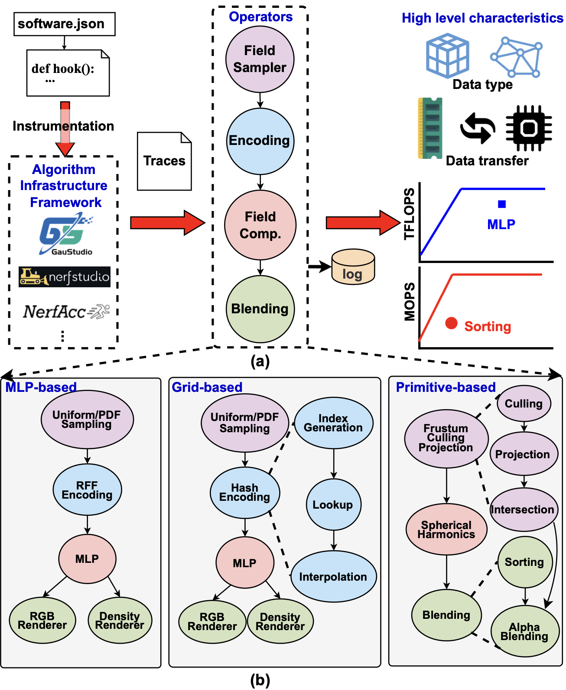

# RenderSim Operator Framework



This folder provides the neural rendering operator taxonomy and performance modeling framework for realistic accelerator analysis, supporting both inference and training workloads.

## Live neural rendering integration

- Complete pipeline integration: Direct connection from traced execution to performance modeling
- Realistic workload analysis: FLOPs and memory derived from NeRF execution
- Hardware-aware scheduling: Operator characteristics inform accelerator design decisions
- Roofline analysis: Bottleneck identification using operator characteristics

### Live neural rendering analysis results
From real NeRF execution traces (4096 rays × 64 samples):
- **HashEncodingOperator**: 786K input → 8.4M output elements, 369M FLOPs
- **MLPOperator**: 8.4M input + 6.4K weights, 3.36B FLOPs
- **Total Pipeline**: 72 operators, 51+ billion FLOPs, 1.7+ GB memory
- **Hardware Impact**: Enables realistic memory bandwidth and compute bottleneck analysis

## Table of Contents

- [Neural Rendering Integration](#neural-rendering-integration)
- [Roofline Analysis](#roofline-analysis)
- [Operator Graph and Scheduling](#operator-graph-and-scheduling)
- [Customized Operators and Pipelines](#customized-operators-and-pipelines)

## Neural Rendering Integration

The operator framework now provides complete integration with live neural rendering execution:

```bash
# Complete neural rendering analysis pipeline
python nerfstudio/nerfstudio/scripts/eval.py --enable-trace ...   # Generate execution_dag.pkl
python CLI/main.py map execution_dag.pkl config.json              # Transform to /Operators
python CLI/main.py schedule mapped.json                           # Realistic scheduling
python CLI/main.py report scheduled.json --format html            # Analysis reports
```

### **Operator Categories and Hardware Mapping**
- **SAMPLING** → Volume Rendering modules: Ray sampling, frustum operations, weight sampling
- **ENCODING** → Encoding modules: Hash encoding, positional encoding, feature encoding  
- **COMPUTATION** → Field Computation modules: MLP, field computation, model inference
- **BLENDING** → Volume Rendering modules: RGB/depth rendering, alpha blending
- **OPTIMIZATION** → Training modules: Gradient computation, pruning, update merging

### **Realistic Characteristics Provided**
- **Tensor Sizes**: Actual neural rendering dimensions (B×N×features)
- **FLOP Counts**: Real compute requirements per operator
- **Memory Bandwidth**: Realistic data movement analysis
- **Performance Modeling**: Hardware bottleneck identification

## Roofline Analysis

Observe high-level operator characteristics with realistic neural rendering workloads:

```bash
python plot_roofline.py
```

**Enhanced with Real Workloads**: Includes actual neural rendering operator characteristics:
- Arithmetic intensity from real NeRF execution
- Memory requirements from traced workloads  
- FLOP requirements from actual model inference
- Hardware bottleneck identification
- Support for both forward and backward pass analysis


## Operator Graph and Scheduling

Generate operator graphs with realistic neural rendering pipelines:

```bash
python plot_operator.py
```

**Integration with RenderSim Scheduling**: 
- Realistic operator characteristics drive scheduling decisions
- Hardware-aware mapping based on actual workload requirements
- Performance prediction using real neural rendering execution patterns
- Supports both inference and training pipeline visualization


## Customized Operators and Pipelines

### **Enhanced Integration Process**

The operator framework now seamlessly integrates with traced neural rendering execution:

1. **Trace Collection**: Neural rendering execution automatically captured
2. **Operator Classification**: Function names mapped to operator taxonomy  
3. **Realistic Instantiation**: Actual `/Operators` classes created with real parameters
4. **Performance Analysis**: Hardware-aware scheduling with realistic characteristics

### **Example: Real Neural Rendering Operators**

From actual NeRF execution trace:
```python
# Automatically created from traced execution
hash_encoding = HashEncodingOperator(
    dim=(4096, 64),          # 4096 rays × 64 samples  
    input_dim=3,             # 3D coordinates
    num_levels=16,           # Multi-resolution levels
    features_per_level=2,    # Feature encoding
    bitwidth=16,
    backward=False           # Can be set to True for training
)

mlp = MLPOperator(
    dim=(4096, 64),          # Same ray-sample points
    in_dim=32,               # Hash encoding output  
    num_layers=3,            # Network depth
    layer_width=64,          # Hidden layer width
    out_dim=4,               # RGB + density
    bitwidth=16,
    backward=False           # Can be set to True for training
)

# Realistic characteristics automatically computed:
# hash_encoding.get_num_ops() → 369,098,752 FLOPs (forward)
# mlp.get_num_ops() → 3,355,443,200 FLOPs (forward)
# Backward passes typically require ~2x compute for gradient computation
# Total memory: ~70 MB for realistic neural rendering workload
```

### **Supported Pipelines**

The framework includes implementations of various neural rendering pipelines:

**Inference Pipelines**: ICARUS, NeuRex, CICERO, GSCore, SRender  
**Training Pipelines**: GSArch, GBU, Instant3D

All pipelines support forward passes, with training pipelines additionally supporting backward passes through the `backward` parameter in operators.

### **Custom Operator Development**

Build upon the realistic foundation:

**Step 1**: Extend existing operators with your custom neural rendering operations
**Step 2**: Leverage automatic parameter extraction from traced execution
**Step 3**: Integrate with hardware-aware scheduling for realistic performance analysis
**Step 4**: Use roofline analysis capabilities for bottleneck identification

### **Pipeline Integration Example**

```python
# Automatic pipeline creation from traced execution
from Instrumentation.dag_to_operators_integration import load_and_transform_traced_dag

# Load traced DAG and transform to realistic operators
scheduler_graph, impact = load_and_transform_traced_dag("execution_dag.pkl")

print(f"Realistic operators: {impact['transformation_summary']['nodes_processed']}")
print(f"Total FLOPs: {impact['transformation_summary']['total_flops']}")  
print(f"Memory workload: {impact['transformation_summary']['total_memory_mb']}")

# Ready for realistic hardware analysis!
```

## Testing

Comprehensive test suite available in the `utils/` directory:

```bash
# Quick validation (< 1 second)
python utils/test_quick.py

# Test all pipelines (inference + training)
python utils/test_all_pipelines.py

# Verify training support implementation
python utils/test_verify_training.py

# Generate pipeline visualizations
python utils/test_visualization.py
```

See `utils/README.md` for detailed test documentation.

## Capabilities

The operator framework integration enables:

### Realistic performance modeling
- **Before**: Generic [1] shapes, 0 FLOPs, meaningless analysis
- **After**: 51+ billion FLOPs, 1.7+ GB workloads, hardware bottleneck identification

### Hardware-software co-design
- Memory bandwidth bottleneck identification
- Compute vs. memory bound analysis  
- Realistic accelerator design feedback
- Neural rendering performance prediction

### Research and development
- Roofline analysis with actual neural rendering characteristics
- Hardware-aware algorithm optimization
- Accelerator architecture exploration
- Performance optimization guidance

The operator framework provides a foundation for realistic neural rendering accelerator analysis and design.