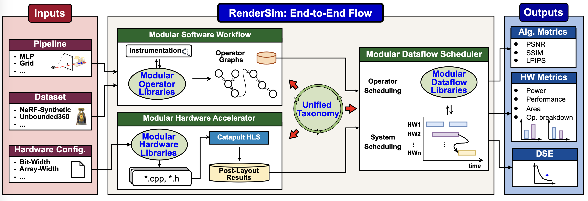
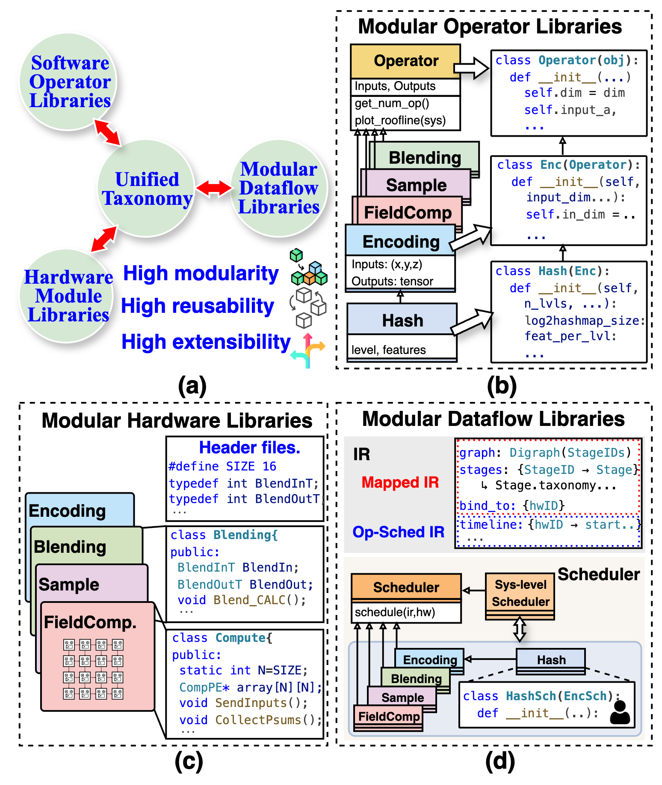

# RenderSim

# ★ ★ ★ See [CHANGELOG.md](CHANGELOG.md) for the changes.

RenderSim is a small, self-contained simulator for neural rendering accelerators. Given an execution DAG (.pkl), it maps operators to a configurable hardware model, schedules them, and writes PPA report.



## Table of Contents
- [Overview](#overview)
- [Folder structure](#folder-structure)
- [Requirements](#requirements)
- [Install and build](#install-and-build)
- [Quick setup (Nerfstudio + tracing)](#quick-setup-nerfstudio--tracing)
- [Collect a trace with Nerfstudio (ns-eval)](#collect-a-trace-with-nerfstudio-ns-eval)
- [End-to-end with ICARUS PPA](#end-to-end-with-icarus-ppa)
- [Outputs](#outputs)
- [Modular Design](#modular-design)


## Overview
- Instrumentation: collect traces with Nerfstudio and transform to realistic operators (see [Instrumentation](Instrumentation/README.md) and [Operators](Operators/README.md))
- Mapping: map operators to hardware units (see [Scheduler](Scheduler/README.md))
- Scheduling and PPA: system-level scheduling with optional PPA estimation (see [Scheduler](Scheduler/README.md) and [Hardware](Hardware/README.md))
- Reporting: interactive analysis report and visuals (see [Visualization](Visualization/README.md))

## Folder structure
- [CLI/](CLI/): command-line entry points
- [Scheduler/](Scheduler/): mapping and scheduling (C++ and Python)
- [Instrumentation/](Instrumentation/): helpers to inspect/transform DAGs
- [Operators/](Operators/): operator taxonomy, plotting, and integration (see [Operators/README.md](Operators/README.md))
- [Hardware/](Hardware/): accelerator configs, scripts, and [examples](Hardware/examples/) (see [Hardware/README.md](Hardware/README.md))
- [Visualization/](Visualization/): schedule Gantt, operator graph, and PPA dashboard (see [Visualization/README.md](Visualization/README.md))
- [tests/](tests/): end-to-end, mapping, scheduler, latency, and PPA tests

## Requirements
- Python 3.8+
- C++17 compiler and CMake 3.16+
- Nerfstudio environment to collect real traces

## Install and build
```bash
conda create -n rendersim python=3.8 -y
conda activate rendersim
pip install -e .
# Initialize submodules (Ramulator 2.0)
git submodule update --init --recursive
./build_cpp.sh
```

For detailed environment setup, training, and multi-model eval (vanilla-nerf, instant-ngp, splatfacto), see `Instrumentation/README.md`.

## Quick setup (Nerfstudio + tracing)
```bash
# Use included submodule (editable)
cd nerfstudio && pip install -e . && cd -

# Optional: external checkout instead of submodule
# git clone https://github.com/nerfstudio-project/nerfstudio.git
# cd nerfstudio && pip install -e . && cd -

# Copy vendor reference files (tracing, eval, trace_config) into your checkout
cp -f Instrumentation/nerfstudio_vendor/instrumentation/tracing.py nerfstudio/nerfstudio/instrumentation/ || true
cp -f Instrumentation/nerfstudio_vendor/instrumentation/trace_config.json nerfstudio/nerfstudio/instrumentation/ || true
cp -f Instrumentation/nerfstudio_vendor/scripts/eval.py nerfstudio/nerfstudio/scripts/ || true
cp -f Instrumentation/nerfstudio_vendor/utils/eval_utils.py nerfstudio/nerfstudio/utils/ || true
```

## Collect a trace with Nerfstudio (ns-eval)
Quick example with vanilla-nerf:
```bash
# If you have already trained vanilla-nerf, locate its config
CONFIG=$(find output_result -path "*vanilla-nerf*/*/config.yml" | head -n1)
echo "$CONFIG"  # should be something like output_result/.../vanilla-nerf/.../config.yml

# Evaluate one image with tracing enabled (writes execution_dag.pkl)
OUT=traces/vanilla_$(date +%Y%m%d_%H%M%S)
mkdir -p "$OUT"
DISABLE_TRACE_PLOT=1 \
ns-eval \
  --load-config "$CONFIG" \
  --render-output-path "$OUT" \
  --enable-trace \
  --trace-config-path nerfstudio/nerfstudio/instrumentation/trace_config.json \
  --eval-image-indices 0
# Trace: $OUT/execution_dag.pkl
```
If you have not trained yet, follow the training section in `Instrumentation/README.md` first.

See Instrumentation/README.md for `ns-eval` flags and environment variables (including DISABLE_TRACE_PLOT).

### End-to-end with ICARUS PPA
- Default analyze runs the full /Operators transform and invokes PPA (Ramulator). To skip PPA, add `--no-ppa`.
- Ensure you pass your hardware JSON explicitly so scheduling and PPA use the intended config.

```bash
# Generate trace with ns-eval (from section above) so $OUT/execution_dag.pkl exists

# Run end-to-end (map → schedule → report) with ICARUS
./render_sim analyze "$OUT/execution_dag.pkl" output_icarus_ppa \
  --hardware Hardware/examples/hardware_configs/icarus_config.json \
  --report-format html
```

### Running steps separately
If you prefer to run scheduling directly, pass the hardware config explicitly (new flag):
```bash
# Map (produces output_icarus/mapping/mapped_ir.json)
./render_sim map "$OUT/execution_dag.pkl" Hardware/examples/hardware_configs/icarus_config.json \
  -o output_icarus/mapping/mapped_ir.json

# Schedule (with PPA) — note the required --hardware flag
./render_sim schedule output_icarus/mapping/mapped_ir.json \
  -o output_icarus/scheduling/scheduled_ir.json \
  --hardware Hardware/examples/hardware_configs/icarus_config.json

# Report
./render_sim report output_icarus/scheduling/scheduled_ir.json \
  -o output_icarus/reports/analysis_report.html --format html
```

### Notes
- The first PPA run builds Ramulator automatically under `Hardware/ramulator2/`.
- Full /Operators transform is the default. For faster fallback parsing, use `--basic-parser` (reduced fidelity).
- If you see placeholder PPA fields (zeros), re-run analyze without `--no-ppa` and ensure `--hardware` is provided (analyze now passes it through to scheduling).

## Outputs

Outputs in the chosen directory:
- mapped_ir.json: operator mapping from the traced DAG to standardized operator types and hardware module types
- scheduled_ir.json: scheduled intermediate representation (per-op dependencies, start/end times, and resource assignments)
- analysis_report.html: interactive HTML report with pipeline breakdown, schedule timeline, and bottleneck analysis
- summary.md: short human-readable summary of key metrics (ops, memory, utilization) and run configuration

## Modular Design



The project follows modular design. See component guides: [Scheduler](Scheduler/README.md), [Instrumentation](Instrumentation/README.md), [Hardware](Hardware/README.md). 