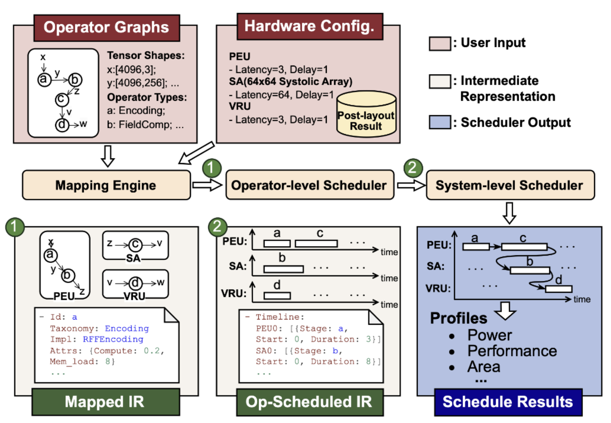

# RenderSim Scheduler



This folder schedules the neural-rendering operator graph defined in `Operator` onto the hardware modules specified in `Hardware`, and calculates the resulting latency.

## Table of Contents
- [Unified analysis (CLI)](#unified-analysis-cli)
- [Overview](#overview)
- [Components](#components)
- [Inputs and outputs](#inputs-and-outputs)
- [How to run (CLI)](#how-to-run-cli)
- [Build the C++ core (optional)](#build-the-c-core-optional)
- [How to extend](#how-to-extend)
- [Direct API (C++ bindings)](#direct-api-c-bindings)
- [Python-only prototyping](#python-only-prototyping)

## Unified analysis (CLI)

Use the end-to-end CLI to map, schedule, and generate reports from a traced DAG:

```bash
./render_sim analyze traces/.../execution_dag.pkl results \
  --hardware Hardware/examples/hardware_configs/icarus_config.json
```

Outputs are organized under `results/` (inputs, mapping, scheduling, reports, visuals).

### Optional: DOT subgraph extraction
If you have a grouped DOT (e.g., `execution_dag_grouped.dot`), you can extract and render a specific cluster as part of analyze:

```bash
./render_sim analyze traces/.../execution_dag.pkl results \
  --hardware Hardware/examples/hardware_configs/icarus_config.json \
  --plot-dot-subgraph \
  --dot execution_dag_grouped.dot \
  --cluster-index coarse:0 \
  --subgraph-out-prefix execution_dag_component0
```

Subgraph PNG/SVG/DOT will be written under `results/visuals/` with the given prefix. For the standalone helper, see `Instrumentation/README.md`.

## Overview

The scheduler maps transformed operators to hardware units and produces an execution order with start/end times and resource assignments. It supports:
- Operator-level scheduling (intra-operator ordering and constraints)
- System-level scheduling (resource-aware placement and timing)
- Optional PPA estimation using the C++ core

## Components
- Python
  - `mapping/`: load and validate hardware configs
  - `IR/`: scheduler IR utilities
  - `op_sched/`: operator-level scheduling utilities
  - `gscore_schedule.py`: example design-space exploration flow (GSCore)
- C++ core (`cpp/`)
  - `operator_scheduler`, `system_scheduler`, `mapping_engine`, `ppa_estimator`
  - Python bindings built via `./build_cpp.sh`

## Inputs and outputs
- Inputs
  - `mapped_ir.json` (from map stage) or an execution DAG transformed via the unified CLI
  - Hardware config JSON (see `Hardware/examples/hardware_configs/`)
- Outputs
  - `scheduled_ir.json`: per-op timing, resource assignments, and dependencies
  - Optional PPA metrics embedded in the schedule

## How to run (CLI)
Run scheduling only:
```bash
./render_sim schedule results/mapping/mapped_ir.json -o results/scheduling/scheduled_ir.json
```
End-to-end (map -> schedule -> report) is documented in the root README and above.

## Build the C++ core (optional)
```bash
./build_cpp.sh
```
This compiles the C++ operator/system scheduler and PPA estimator used by the CLI.

## How to extend
- Scheduling policy (operator-level)
  - Add or modify policies under `Scheduler/op_sched/`
  - Integrate policy selection where operator-level scheduling is invoked
- Scheduling policy (system-level / C++)
  - Extend `operator_scheduler` or `system_scheduler` in `Scheduler/cpp/src/` and corresponding headers in `Scheduler/cpp/include/`
  - Rebuild with `./build_cpp.sh`
- Hardware units and configs
  - Update or add JSON files under `Hardware/examples/hardware_configs/`
  - Ensure parsing in `Scheduler/mapping/hw_config.py` supports new fields

For the IR written by the scheduler, see `scheduled_ir.json` produced in `results/scheduling/` when using the unified CLI.

## Direct API (C++ bindings)

After building the C++ core, you can call the schedulers directly from Python via pybind11:

```bash
# Ensure the module path is visible
PYTHONPATH=build/Scheduler/cpp python - << 'PY'
import rendersim_cpp as rs

# Load mapped IR produced by the map stage
mapped_ir = rs.load_mapped_ir_from_json('results/mapping/mapped_ir.json')

# Operator-level scheduling
optlib = rs.OptimizationLibrary()
optimizer = rs.AnalyticalOperatorOptimizer(optlib)
op_scheduler = rs.OperatorLevelScheduler(optimizer)
op_scheduled_ir = op_scheduler.schedule(mapped_ir)

# System-level scheduling
sys_scheduler = rs.SystemLevelScheduler()
system_schedule = sys_scheduler.schedule(op_scheduled_ir)

print('Total cycles:', system_schedule.total_cycles)
PY
```

## Python-only prototyping

For quick experiments without modifying the C++ core, you can prototype policies in `Scheduler/op_sched/` and use the unified CLI for execution. For full performance and PPA estimation, use the C++ bindings built via `./build_cpp.sh`.